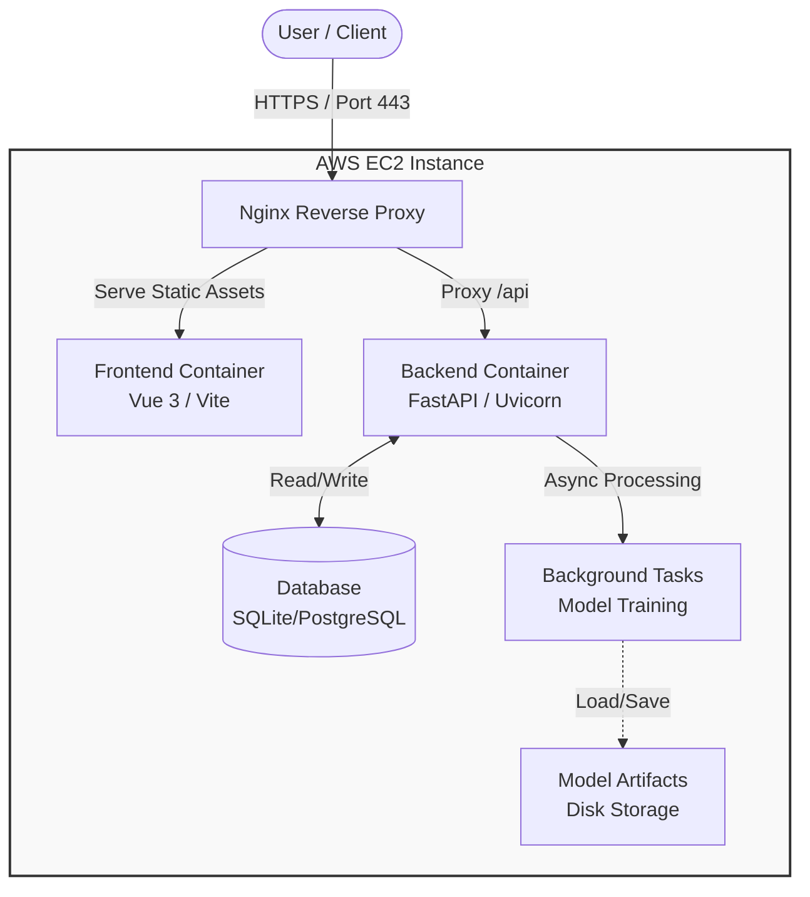
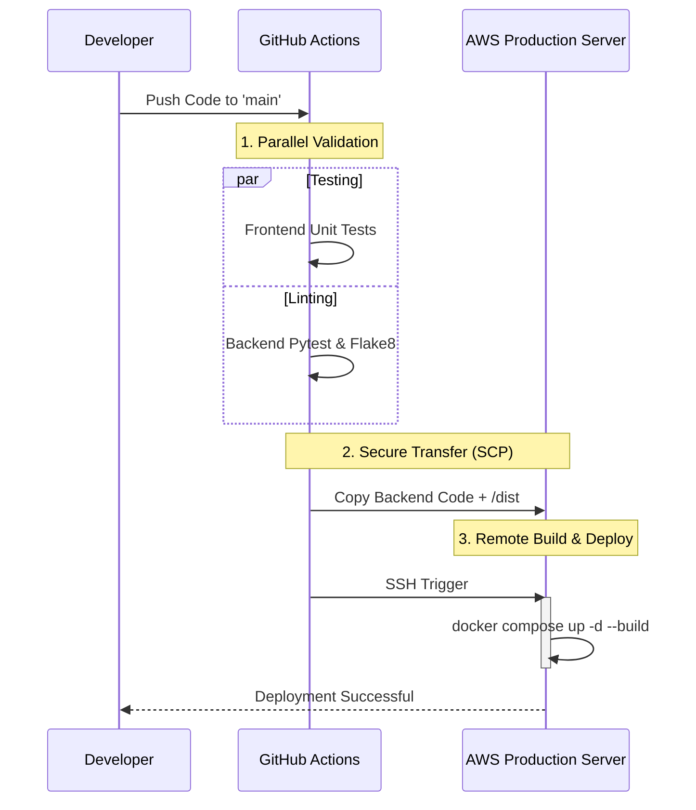

# ML Platform — Self-Service Model Registry & Inference

[](LICENSE)


## 📖 About The Project

A full-stack platform for registering trained ML models, browsing the registry, running predictions on new datasets, and downloading results.

Unlike simple demo scripts, this project demonstrates an **end-to-end Data Science Lifecycle implementation**—from data ingestion and asynchronous model training to RESTful API deployment and interactive visualization. It is engineered with a focus on **Type Safety**, **Scalability**, and **DevOps Automation**.

### ✨ Key Features

* **📊 Interactive Dashboard**: Real-time visualization of system metrics and model performance (Accuracy/Precision) built with **Element Plus**.
* **🧠 Asynchronous Training**: Leverages **FastAPI BackgroundTasks** to handle resource-intensive ML training jobs without blocking the main thread.
* **🔄 End-to-End Pipeline**: Seamless flow from raw CSV upload -> Data Cleaning -> Training -> Inference -> Reporting.
* **🛡️ Type-Safe Architecture**: Full TypeScript implementation on the frontend synced with Pydantic models on the backend.
* **🚀 Automated DevOps**: A custom **GitHub Actions CI/CD pipeline** that automates testing and deployment to AWS EC2 using an efficient on-premise build strategy.

---

## 🛠️ Technical Stack

- **Backend**: Python 3.11, FastAPI, SQLAlchemy, Pydantic
- **Frontend**: Vue 3 + TypeScript, Vite, Pinia, Element Plus
- **ML**: scikit-learn, pandas, numpy
- **Infra**: Docker Compose, AWS EC2, Nginx
- **CI/CD**: GitHub Actions (Pytest + Flake8)

---

## 🏗️ System Architecture & Deployment

The application follows a **Microservices-ready** architecture deployed on a single AWS EC2 instance. **Nginx** acts as the reverse proxy and static file server, ensuring secure and efficient traffic routing.

### 1. Runtime Architecture
The application follows a **Microservices-ready** architecture deployed on a single AWS EC2 instance using Docker Compose. **Nginx** acts as the reverse proxy and static file server, ensuring secure and efficient traffic routing.



### 2. CI/CD Pipeline (Automated Deployment)
To optimize costs for this project, I implemented an "On-Premise Build" strategy instead of using an external container registry. The pipeline ensures that only verified code reaches the production server.

Workflow Steps:

**Validation**: GitHub Actions runs parallel tests for Frontend (Jest) and Backend (Pytest).

**Transfer**: Verified artifacts are securely transferred to AWS EC2 via SCP.

**Live Build**: Docker images are built directly on the server to ensure environment consistency.


---

## 🚀 Getting Started

Follow these steps to set up the project locally for development.

### Prerequisites

*   **Node.js** (v18+) & npm
*   **Python** (v3.9+)
*   **Git**

### 1. Clone the Repository

```bash
git clone [https://github.com/hugohu789-droid/ml-platform.git](https://github.com/hugohu789-droid/ml-platform.git)
cd ml-platform
```

### 2. Backend Setup

Navigate to the backend directory, set up a virtual environment, and install dependencies.

```bash
cd backend

# Create & activate virtual environment
python -m venv venv
source venv/bin/activate  # Windows: .\venv\Scripts\activate

# Install dependencies
pip install -r requirements.txt

# Run the server (Hot Reload enabled)
uvicorn app.churn_api:app --reload --host 0.0.0.0 --port 8000
```
*The API will be available at `http://localhost:8000`*
*API Docs: `http://localhost:8000/docs`*

### 3. Frontend Setup

```bash
cd frontend

# Install dependencies
npm install

# Start development server
npm run dev
```
*The application will be available at `http://localhost:5173`*

---

## 📂 Project Structure

```text
ml-platform/
├── .github/workflows/  # CI/CD Pipeline definitions
├── backend/
│   ├── app/
│   │   ├── tests/   # tests/ directory
│   │       ├── test_api.py    #test code for the API
│   │   ├── churn_api.py    # FastAPI entry point & Routes
│   │   ├── models.py       # Pydantic & SQLAlchemy Models
│   │   └── modeltrain.py   # Core ML Logic (Scikit-Learn)
│   ├── requirements.txt
│   └── docker-compose.yml      # Container Orchestration
├── frontend/
│   ├── src/
│   │   ├── api/            # TypeScript API Service layer
│   │   ├── views/          # Vue Components (Dashboard, Prediction)
│   │   ├── stores/         # Pinia State Management (Optional)
│   │   └── types/          # TypeScript Interfaces
│   ├── package.json
└── README.md
```

---

## 🔮 Future Improvements

**Authentication**: Implement JWT (JSON Web Token) based login system for multi-user support.

**Advanced Monitoring**: Integrate Prometheus and Grafana for real-time server metrics.

**Model Versioning**: Implement MLflow to track model experiments and versions.

**Caching**: Introduce Redis to cache prediction results and reduce latency.

---

## 👤 Author

**Hugo**
* **Role**: Senior Software Developer (C++ / Java / C# / Python / Full Stack)
* **GitHub**: [@hugohu789-droid]()

---

*This project is for educational and demonstration purposes.*